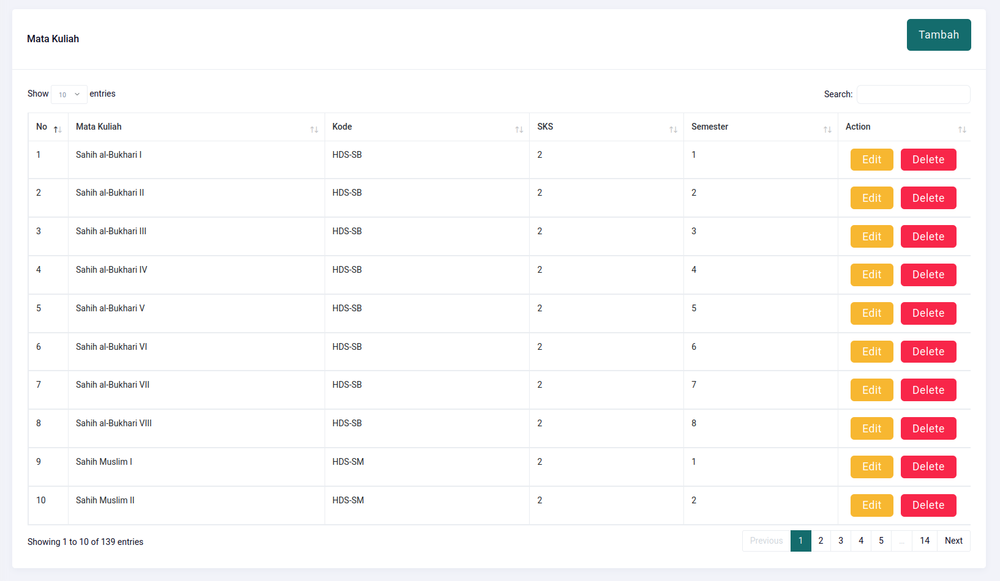

# Mata Kuliah

## Create

| Field    | Type    | Required | Example            |
| -------- | ------- | :------: | ------------------ |
| Nama     | String  |    ✅    | Sahih al-Bukhari I |
| Kode     | String  |    ✅    | HDS-SB             |
| SKS      | Integer |    ✅    | 2                  |
| Semester | Integer |    ✅    | 1                  |

## Read

## Update

Ubah data jika diperlukan. Hati-hati dalam mengubah data mata kuliah.

## Delete

Hapus data jika diperlukan. Hati-hati dalam menghapus data mata kuliah.

