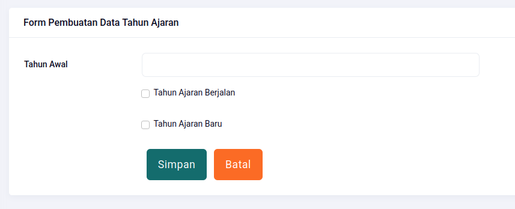

# Tahun Ajaran

## Create

| Field                 | Type     | Required | Example |
| --------------------- | -------- | :------: | ------- |
| Tahun Awal            | Integer  |    ✅    | 2025    |
| Tahun Ajaran Berjalan | Checkbox |    ❌    |         |
| Tahun Ajaran Baru     | Checkbox |    ❌    |         |

Jika saat ini adalah tahun ajaran 2025-2026, maka *Tahun Awal* diisi dengan *2025* dan centang opsi *Tahun Ajaran Berjalan*.

Lalu buat data baru dengan *Tahun Awal* diisi dengan *2026* dan centang opsi *Tahun Ajaran Baru*.

## Read

Data yang telah diinput akan muncul beruturan dari tahun ajaran paling besar (2026) ke paling kecil (2024)

## Update

Ubah data jika diperlukan. Hati-hati dalam mengubah data tahun ajaran.

## Delete

Demi kenyamanan dan keamanan sistem, maka data tahun ajaran yang telah diinput, tidak bisa dihapus. Karena dapat menyebabkan kerusakan data lain yang berhubungan dengan tahun ajaran tersebut.

