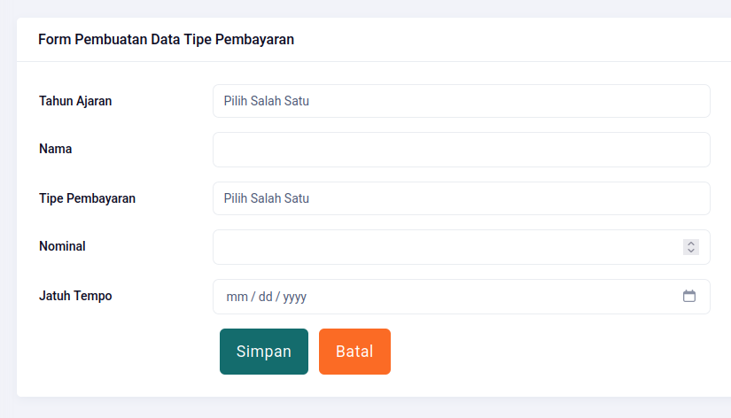
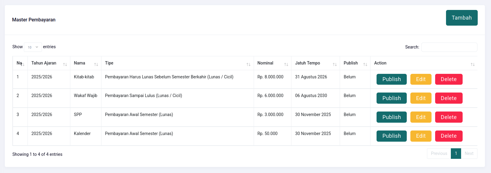
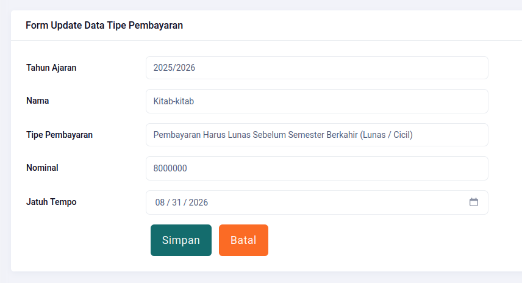
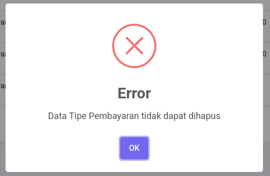

# Tipe Pembayaran

## Create

| Field           | Type     | Required | Example                              |
| --------------- | -------- | :------: | ------------------------------------ |
| Tahun Ajaran    | Dropdown |    ✅    | 2025/2026                            |
| Nama            | String   |    ✅    | Wakaf Wajib                          |
| Tipe Pembayaran | Dropdown |    ✅    | Pembayaran Awal Semester (Lunas)     |
| Nominal         | Integer  |    ✅    | 6000000                              |
| Jatuh Tempo     | Date     |    ✅    | bulan/tanggal/tahun (**12/30/2025**) |

## Read

## Update

Ubah data jika diperlukan. Hati-hati dalam mengubah data tipe pembayaran. Pembayaran yang telah dilakukan tidak ikut berubah dengan perubahan ini.

## Delete

Demi kenyamanan dan keamanan sistem, maka data tipe pembayaran yang telah diinput, tidak bisa dihapus. Karena dapat menyebabkan kerusakan data lain yang berhubungan dengan tipe pembayaran tersebut.

